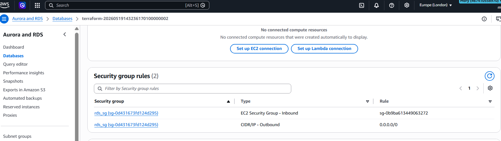
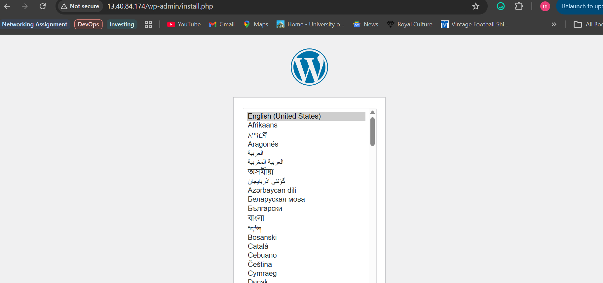

# Assignment – Deploy WordPress Using Terraform

This assignment will aim to deploy WordPress on an AWS EC2 instance using Terraform whilst connecting the instance to a database for WordPress to store its data using Terraform. This database will be configured using AWS RDS service.

## Objectives

The objectives and deliverables of this project are as follows:

* EC2 instance running WordPress
* Security groups
* User data to install dependencies
* A working public endpoint 
* main.tf with AWS provider, EC2 resource and required settings
* variables.tf for inputs
* outputs.tf for instance details
* All resources provisioned via Terraform

## Configuration

### Project Structure 
```

├── README.md 
├── images
│   ├── db_sg_rules.png
│   ├── ec2_instance.png
│   ├── rds_database.png
│   └── wordpress.png
├── main.tf
├── modules
│   ├── ec2
│   │   ├── main.tf
│   │   ├── output.tf
│   │   └── variables.tf
│   ├── rds
│   │   ├── main.tf
│   │   ├── output.tf
│   │   └── variables.tf
│   └── vpc
│       ├── main.tf
│       ├── output.tf
│       └── variables.tf
├── output.tf
├── provider.tf
├── terraform.tfstate
├── terraform.tfstate.backup
├── terraform.tfvars
├── userdata.sh
└── variables.tf
```

### Application (EC2)

The aws_instance resource type provides an attribute called `user_data` which let’s us provide a shell script that runs as soon as the instance is provisioned. We will use this attribute to provide a script for the instance. The EC2 instance will host the WordPress site and include wordpress bootstapped via userdata.

The EC2 instance will be depolyed:

* In a public subnet 
* Wordpress bootstrapped via `user_data`
* Security group allowing TLS inbound traffic `HTTP/HTTPS and SSH` and all outbound traffic

### RDS (Database)

A relational (mySQL) database is an important part of any WordPress site. WordPress sites have complex data that it needs to store in a database, making the website functional and smooth. It stores account information, all the website content as well as it’s configuration settings.

A secure username and password are needed to be able to configure the database. This is inputted as a variable which is passed in via a `.tfvars` file as it is sensitive information that should not be compromised or exposed in the resource code. 

The Database is configured with:

* Database layer using AWS RDS mySQL
* The RDS security group allows inbound MySQL traffic from the EC2 security group only




* Database deployed in a private subnet

### Networking (VPC/Subnets)

We will create this project within the AWS cloud environment, we need to build a Virtual Private Cloud. This VPC will be our own network which will allow us to isolate the resources. 

A VPC also let’s us add the following resources to our network:

* Subnets - Public and Private
* Internet gateway - Enables the communication and connection of our resources to the internet
* Route table controlling the traffic flow
* Route table asscoiation to public subnets

### Deployment

Once all resources are configured, you can now deploy the infrastructure via:

```
terraform init  # initialises backend
terraform plan  # shows user what will be configured
terraform apply # provisions resources
```
### Wordpress site

Once the terraform configuration is applied and the EC2 public IP is outputted, the wordpress site loads successfully.



Once objective is achieved, all resources can be destroyed to not incur charges. This is done by utilising `terraform destroy`

## Lessons Learned

* How Terraform state tracks deployed infrastructure and why keeping state files safe and consistent is important.

* How Terraform manages AWS resources such as EC2 instances, security groups, networking rules, and instance configuration in one repeatable workflow.

* Importance of variable hierarchy

* Because modules are isolated and do not interact with eachother, the `main.tf` file uses output variables from the modules to pass them in as inputs in other modules to tie them together. This allows modules to be reusable accross multiple environments.